# RAG Eval 平台技术规格说明书

| 属性 | 内容 |
|------|------|
| 文档版本 | v1.0 |
| 适用代码库 | `rag-eval/` |
| 最后更新 | 2026-05-18 |
| 读者对象 | 后端/前端开发、算法工程师、测试与运维 |
| 关联文档 | [框架设计稿](./rag-eval-framework-design.md)、[14 组分批规则](./循环测试_14组分批规则.md) |

---

## 目录

1. [概述](#1-概述)
2. [系统架构](#2-系统架构)
3. [技术栈与代码组织](#3-技术栈与代码组织)
4. [核心模块设计](#4-核心模块设计)
5. [数据模型](#5-数据模型)
6. [业务流程与时序图](#6-业务流程与时序图)
7. [评测指标体系](#7-评测指标体系)
8. [REST API 概览](#8-rest-api-概览)
9. [前端架构](#9-前端架构)
10. [部署、运维与安全](#10-部署运维与安全)
11. [扩展开发指南](#11-扩展开发指南)

---

## 1. 概述

### 1.1 背景与定位

RAG Eval（RAG Evaluation Framework）是一套**独立于业务 RAG 服务**的评测平台，最初为 **dagent** 知识库与 Agent 能力构建，但通过 `RAGAdapter` 抽象层保持**平台无关**：任何能通过 HTTP 提供「语义检索」与「Agent 对话」能力的系统均可接入。

将评测从生产服务中剥离的设计动机包括：

- **资源隔离**：大批量评测（数万条问答、多轮循环）不占用线上推理配额；
- **技术选型自由**：Judge 模型、Embedding 服务、存储均可独立升级；
- **可复用**：同一套指标与 UI 可对比不同版本 dagent、不同知识库切片策略或竞品 RAG；
- **可自动化**：SDK/CLI 适合接入 CI，在发版前做回归门禁。

### 1.2 设计目标

| 目标 | 实现方式 |
|------|----------|
| 检索 + 生成全链路评测 | `EvalRunner` 编排 retrieve → 规则指标 → chat → LLM Judge |
| 低标注成本 | LLM 自动出题、Faithfulness 等无需 gold chunk |
| 知识库专项能力 | 单跳/多跳召回、循环压测、MD 问答集解析 |
| 人机协作 | Web UI 审核出题、查看 Judge 推理明细 |
| 可观测 | 任务进度、分章节报告、AI 文字解读 |

### 1.3 能力矩阵

平台在「评测深度」与「使用场景」两个维度上提供六类能力：

| 能力 | 典型用户 | 是否依赖 LLM Judge | 主要产出 |
|------|----------|---------------------|----------|
| 综合评测（eval_task） | 算法/质量 | 是（部分指标） | `eval_report`、雷达图 |
| 测试集 LLM 生成 | 数据标注 | 是 | `eval_sample` |
| 单跳召回测试 | 检索工程师 | 否 | 命中率、余弦相似度 |
| 多跳召回测试 | 检索工程师 | 可选 | 分跳命中、全链路命中 |
| QA 生成（qa_gen） | 数据生产 | 是 | `qa_gen_question` |
| 循环测试（loop） | 大规模压测 | 是 | 多轮问答 + 召回验证 |

### 1.4 术语表

| 术语 | 含义 |
|------|------|
| **切片（Chunk）** | 知识库中文档经切分后的最小检索单元，含 `chunk_id`、headers、正文 |
| **单跳（Single-hop）** | 一个问题对应一次检索即可回答 |
| **多跳（Multi-hop）** | 需按跳次（hop）依次检索不同章节/文件 |
| **Judge** | 使用 LLM（及 Embedding）对回答/上下文打分的组件 |
| **Adapter** | 对接外部 RAG 平台的 HTTP 客户端封装 |
| **循环任务（Loop）** | 多轮「生成问答 → 去重 → 单跳验证」的自动化流水线 |
| **任务组 / 批次** | 大规模循环测试时，按每 100 切片一批、每 3 批一组的规划单位 |

---

## 2. 系统架构

### 2.1 逻辑分层架构

系统采用经典三层架构，**评测核心逻辑集中在 Python SDK**，Server 负责持久化、任务调度与 API 暴露，Frontend 负责交互与可视化。

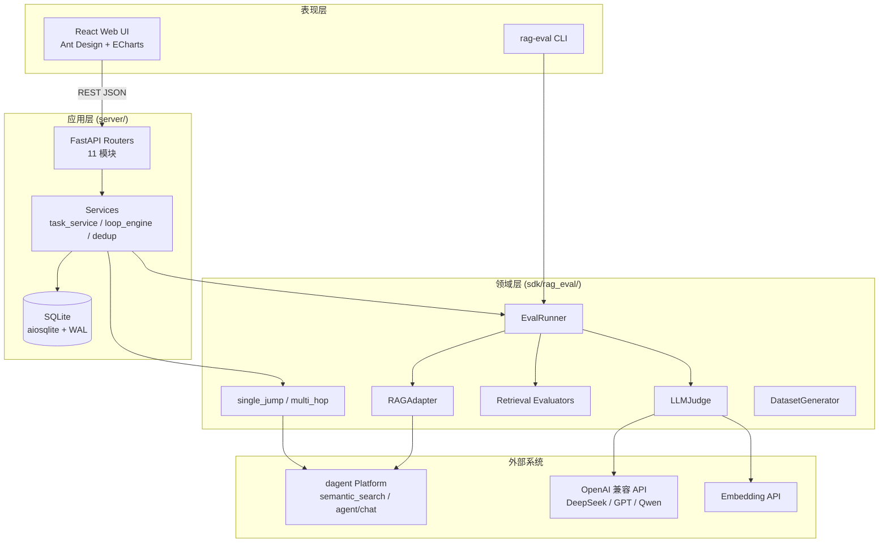

**关键设计决策：**

1. **Server 通过 `sys.path.insert` 引用 SDK**，而非将 SDK 发布为独立 wheel 后再依赖——开发迭代快，但部署时需保证 `sdk/` 与 `server/` 目录相对位置固定。
2. **长任务采用「提交后立即返回 + 后台 asyncio 协程」**，状态写入 SQLite，前端轮询进度。
3. **循环任务暂停/恢复**通过进程内 `_loop_controls` 字典 + `asyncio.Event` 实现，多 Worker 部署时需注意状态不共享（当前为单进程假设）。

### 2.2 部署架构

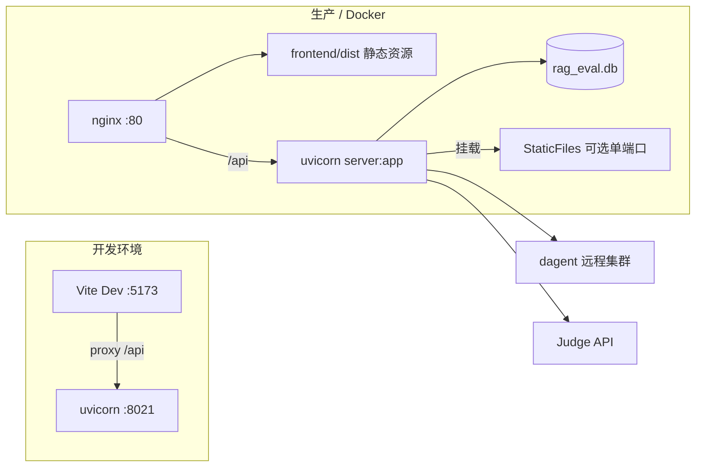

| 组件 | 默认端口 | 说明 |
|------|----------|------|
| FastAPI | 8021（`main.py`）/ 8003（文档示例） | 开发时常用 8021 |
| Vite | 5173 | 仅开发，`vite.config` 代理 API |
| SQLite 文件 | `server/data/rag_eval.db` | WAL 模式，`busy_timeout=30s` |

### 2.3 与 dagent 的集成边界

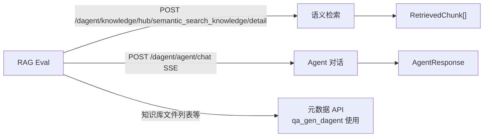

`DagentAdapter` **不 import dagent 内部 Python 包**，仅通过 HTTP 契约交互，保证评测框架可独立发版。

---

## 3. 技术栈与代码组织

### 3.1 技术栈

| 层级 | 技术 | 版本策略 |
|------|------|----------|
| 语言 | Python 3.10+ | Server + SDK |
| Web 框架 | FastAPI | 异步路由、OpenAPI |
| 数据库 | SQLite + aiosqlite | 嵌入式，适合单机大规模评测 |
| HTTP 客户端 | aiohttp（Adapter）、httpx/openai（Judge） | 全异步 |
| 前端 | React 18、TypeScript、Vite、Ant Design | SPA |
| 图表 | ECharts（报告雷达图） | — |
| 包管理 | pip（server）、npm（frontend）、Poetry 可选（sdk） | — |

### 3.2 仓库目录详解

```
rag-eval/
├── docs/                              # 文档与数据资产
│   ├── RAG-Eval平台技术规格说明书.md     # 本文档
│   ├── task_groups_plan.json          # 14 组 × 42 批次机器可读规划
│   ├── exports/                       # 全量问答导出
│   └── …
├── sdk/rag_eval/
│   ├── adapters/          base.py, dagent.py
│   ├── judge/             base.py, openai_compatible.py
│   ├── evaluators/        retrieval.py（Hit/MRR/NDCG）
│   ├── dataset/           schema.py, generator.py
│   ├── single_jump/       parser, mapper, tester, report
│   ├── multi_hop/         parser, tester, report
│   ├── runner.py          综合评测编排
│   ├── report.py          EvalReport / SampleResult
│   └── cli.py             run / generate 子命令
├── server/
│   ├── main.py            应用入口、路由注册、静态资源
│   ├── api/               11 个 APIRouter 模块
│   ├── service/           后台任务与循环引擎
│   └── models/            db.py, schema.sql, 轻量迁移
└── frontend/src/
    ├── pages/             Config, Dataset, Task, Report, SingleJump, MultiHop, QaGen
    └── services/api.ts    REST 封装
```

### 3.3 进程内依赖关系

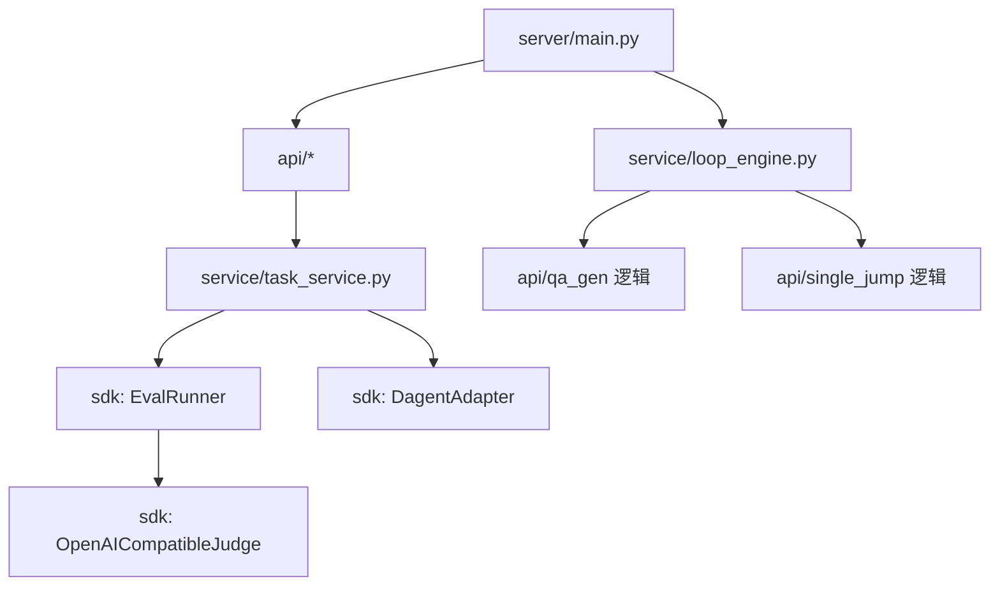

---

## 4. 核心模块设计

### 4.1 RAGAdapter 抽象层

**职责**：屏蔽各 RAG 平台 API 差异，向上提供统一的 `retrieve` 与 `chat`。

```python
# sdk/rag_eval/adapters/base.py（概念接口）
class RAGAdapter(ABC):
    async def retrieve(query, knowledge_hub_id, top_k=10, **kwargs) -> list[RetrievedChunk]
    async def chat(query, agent_id, **kwargs) -> AgentResponse
```

**`RetrievedChunk` 字段：**

| 字段 | 说明 |
|------|------|
| `chunk_id` | 切片唯一 ID（dagent 为 `knowledge_md_header_split_id`） |
| `content` | 正文，用于 Judge 与展示 |
| `score` | 相似度得分（dagent 由 `1 - cosine_distance` 推导） |
| `headers` | 切片标题路径 |
| `file_id` | 所属文件 |

**`DagentAdapter.retrieve` 实现要点：**

- 请求体：`query`, `org_id`, `top_k`, 可选 `knowledge_hub_id`, `file_id_list`
- 合并 `standard_answer_results` 与 `related_knowledge_rerank_results_top` 两路结果后截断至 `top_k`

**`DagentAdapter.chat` 实现要点：**

- SSE 流式解析 `data:` 行，拼接 `message_type` 为 answer 的文本块
- 记录端到端 `latency_ms`

### 4.2 EvalRunner 综合评测编排器

`EvalRunner.run()` 对数据集中每个 `EvalSample`：

1. 受 `asyncio.Semaphore(concurrency)` 限制并发；
2. 按 `RunConfig.should_eval()` 决定计算哪些指标；
3. 检索与生成可独立开关，也支持 `selected_metrics` 精细选择。

**单样本流水线（逻辑顺序）：**

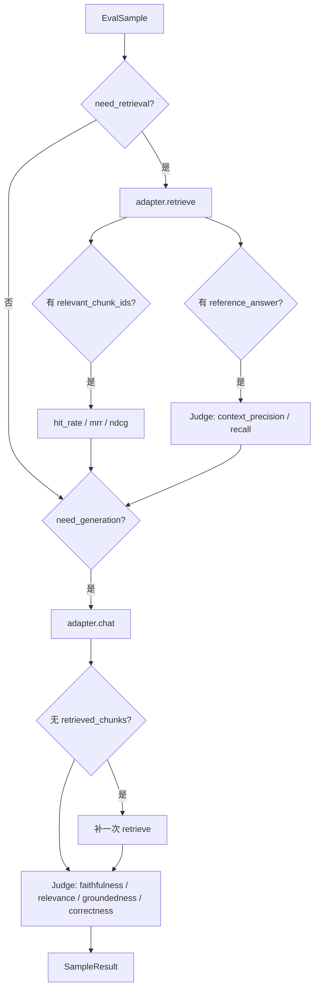

**报告聚合：**

- 各指标算术平均（忽略 `None`）；
- **RAG Score** = Faithfulness、Answer Relevance、Context Precision、Context Recall 四者的**调和均值**（任一项偏低则显著拉低总分）；
- **Hallucination Rate** = Faithfulness < `faithfulness_threshold`（默认 0.7）的样本占比。

### 4.3 LLMJudge（OpenAI 兼容实现）

**设计原则**：Prompt 为中文；输出要求 JSON；失败时返回 `(0.0, raw_detail)` 便于排查。

| 方法 | 算法概要 | 输出范围 |
|------|----------|----------|
| `score_faithfulness` | 回答拆声明 → 逐条验证是否可由 context 推出 | 支持声明占比 |
| `score_relevance` | 由回答反推 3 个问题 → 与原始问题 Embedding 相似度均值 | 0–1 |
| `score_correctness` | 与 reference 的事实一致性 JSON 评分 | 0–1 |
| `score_groundedness` | 声明级标注来源切片编号 | 有源声明占比 |
| `score_context_precision` | 逐 chunk 判定是否对答题有用 | useful/(total) |
| `score_context_recall` | 参考答案拆陈述 → 是否在检索文中被支持 | supported/total |

Faithfulness 两步法降低单次长上下文 Judge 的不稳定性，但会增加 LLM 调用次数（约 1 + N 次 claim 验证）。

### 4.4 单跳召回模块（single_jump）

| 子模块 | 职责 |
|--------|------|
| `parser.py` | 解析 MD：`# 章` → `## section_path` → `Qn` / `**An:**` |
| `mapper.py` | `section_path` 模糊匹配知识库 `file_id`（exact/contains/fuzzy） |
| `tester.py` | 并发调用 dagent 检索 API，写 `RecallResult` |
| `report.py` | 汇总召回率、文件命中率、章节匹配率 |

**命中判定**：在 `hit_top_k` 范围内检查 `expected_chunk_id` 或 `file_id` 是否出现在召回列表。

### 4.5 多跳召回模块（multi_hop）

解析带 `type`、`hops[]` 的多跳问答 MD；对每一跳构造检索 query，分别召回并合并去重；支持 Agent 最终回答与分跳贡献分析。详见 [multi-hop-example.md](./multi-hop-example.md)。

### 4.6 循环引擎（loop_engine）

**目标**：对指定 `file_ids` 列表，在多轮中持续生成不重复问答并用单跳召回验证质量，直至达到 `max_rounds` / `max_questions` 或连续空轮。

**单轮阶段：**

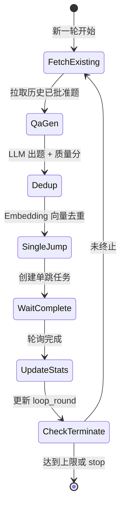

**控制面：**

| 操作 | 机制 |
|------|------|
| 暂停 | `pause_event.clear()` + DB `status=paused` |
| 恢复 | `pause_event.set()` |
| 停止 | `stop=True` + DB `status=stopped` |
| 孤儿恢复 | 启动时 `recover_orphaned_loops()` 将异常退出时的 `running` 改为 `paused` |

### 4.7 去重服务（dedup）

循环任务中默认使用 **Embedding 余弦相似度**（非 LLM）在 section 内及全局（`global_dedup`）检测重复题，阈值可配。历史题目从 `qa_gen_question` 表加载，支持跨任务全局去重以应对 14 组 42 批次大规模跑数。

---

## 5. 数据模型

### 5.1 ER 关系概览

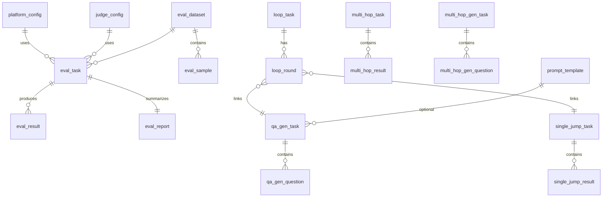

### 5.2 核心表说明

| 表名 | 用途 | 关键字段 |
|------|------|----------|
| `platform_config` | dagent 连接信息 | `base_url`, `org_id`, `token` |
| `judge_config` | Judge + Embedding | `model`, `embed_model` |
| `eval_dataset` / `eval_sample` | 综合评测数据集 | `relevant_chunk_ids` JSON |
| `eval_task` / `eval_result` / `eval_report` | 综合评测任务与结果 | `status`, `progress`, 各指标均值 |
| `single_jump_task` / `single_jump_result` | 单跳召回 | `retrieved` JSON, `is_file_hit` |
| `multi_hop_task` / `multi_hop_result` | 多跳召回 | `hops`, `actual_hops` JSON |
| `qa_gen_task` / `qa_gen_question` | 出题与审核 | `status`, `embedding`, `chunk_id` |
| `loop_task` / `loop_round` | 循环压测 | `current_round`, 累计统计字段 |
| `multi_hop_gen_task` | 多跳 QA 生成 | `source` file/dagent |
| `prompt_template` | Prompt 管理 | `content` |

### 5.3 任务状态机（综合评测）

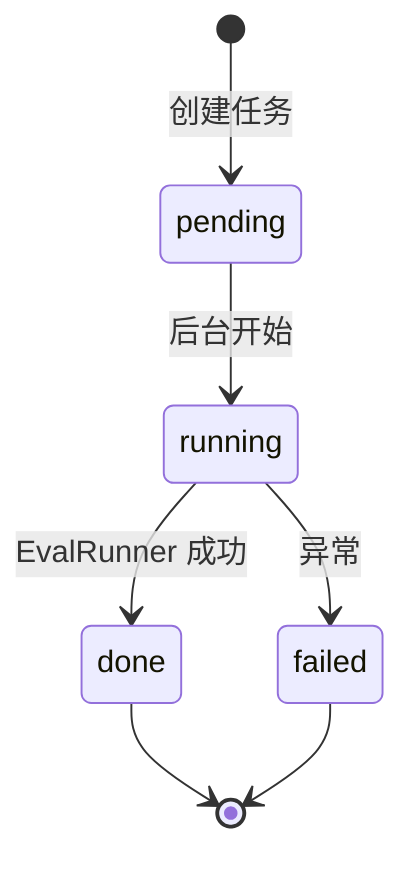

### 5.4 迁移策略

`models/db.py` 中 `_run_migrations()` 对已有库做**向前兼容**列追加（`PRAGMA table_info` 检测），避免破坏已有 `rag_eval.db`。新环境执行 `schema.sql` 全量建表。

---

## 6. 业务流程与时序图

### 6.1 综合评测任务（Web → Server → SDK）

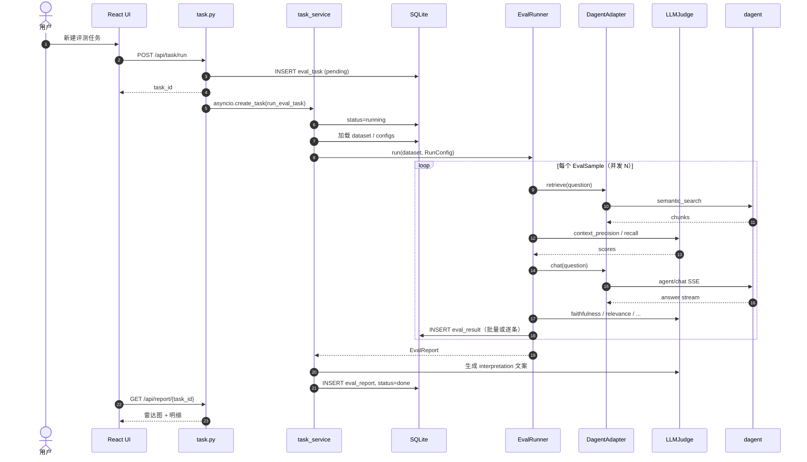

### 6.2 Faithfulness 评判（两步法）

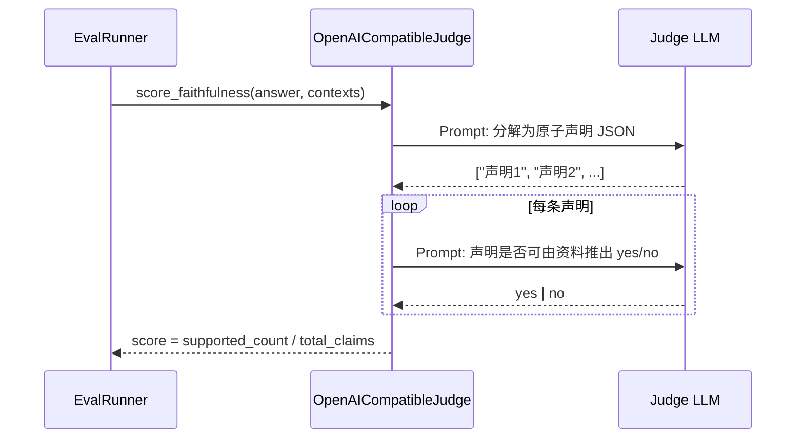

### 6.3 单跳召回测试

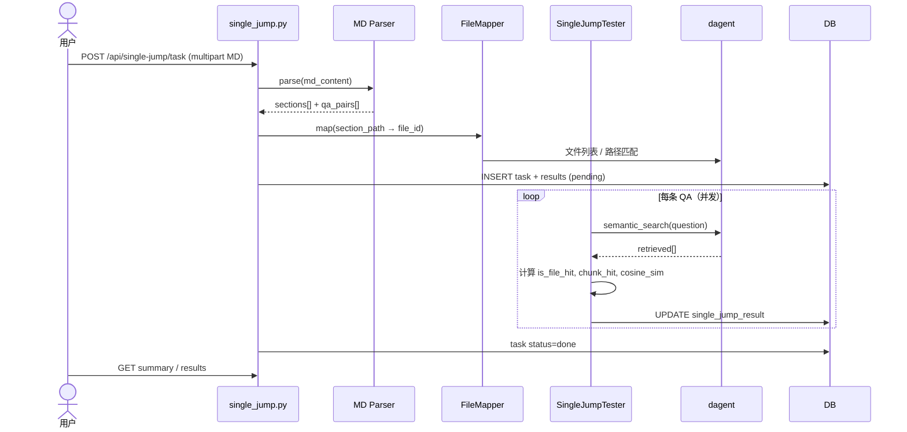

### 6.4 循环测试（单轮）

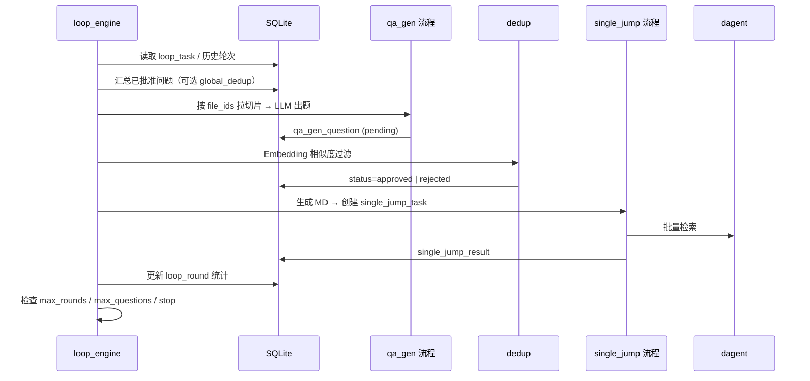

### 6.5 LLM 自动出题（测试集 / qa_gen）

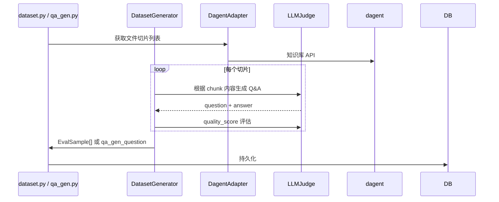

### 6.6 配置管理流程

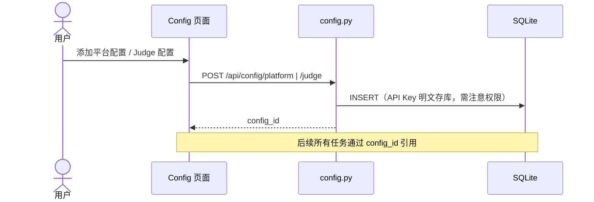

---

## 7. 评测指标体系

### 7.1 检索层（规则指标）

设召回序列为 $[c_1, \ldots, c_K]$，相关集合为 $R$。

| 指标 | 公式 / 定义 | 需要标注 |
|------|-------------|----------|
| **Hit Rate@K** | 若 $R \cap \{c_1..c_K\} \neq \emptyset$ 则为 1，否则 0 | `relevant_chunk_ids` |
| **MRR@K** | $\frac{1}{\text{rank}}$，rank 为第一个相关 chunk 的位置 | 同上 |
| **NDCG@K** | 按相关度折损的 DCG 归一化 | 同上，实现见 `evaluators/retrieval.py` |

### 7.2 检索层（LLM 指标）

| 指标 | 含义 | 典型问题 |
|------|------|----------|
| **Context Precision** | 召回切片中有多少比例对回答真正有用 | 噪声切片多 → 低 |
| **Context Recall** | 参考答案中的事实有多少能在召回中找到 | 切片不全 → 低 |

### 7.3 生成层

| 指标 | 含义 | 低分常见原因 |
|------|------|--------------|
| **Faithfulness** | 回答是否可仅从检索内容推出 | 幻觉、过度推断 |
| **Answer Relevance** | 回答是否切题 | 答非所问、冗长 |
| **Answer Correctness** | 与参考答案事实一致性 | 错误细节 |
| **Groundedness** | 声明是否有明确切片来源 | 无出处断言 |

### 7.4 综合指标

**RAG Score（调和均值）：**

$$
\text{RAG Score} = \frac{n}{\sum_{i=1}^{n} \frac{1}{s_i}}
$$

其中 $s_i$ 为 Faithfulness、Answer Relevance、Context Precision、Context Recall 中非空且 $>0$ 的项。

**Hallucination Rate：**

$$
\text{Hallucination Rate} = \frac{|\{i : \text{faithfulness}_i < \tau\}|}{n}, \quad \tau = 0.7
$$

### 7.5 单跳召回专用指标

| 指标 | 计算 |
|------|------|
| 召回率 | 有检索结果的问题数 / 总问题数 |
| 文件命中率 | `is_file_hit=1` / 有检索结果数 |
| 切片命中率 | `expected_chunk_id` 出现在 top-K |
| 平均余弦相似度 | 召回列表 $1 - \text{cosine\_distance}$ 的统计 |
| 章节匹配率 | 成功映射 file_id 的 section 数 / 总 section 数 |

### 7.6 指标解读阈值（建议）

| 指标 | 优秀 | 良好 | 需关注 |
|------|------|------|--------|
| Hit Rate | > 0.90 | 0.70–0.90 | < 0.70 |
| MRR | > 0.80 | 0.60–0.80 | < 0.60 |
| Faithfulness | > 0.85 | 0.70–0.85 | < 0.70 |
| RAG Score | > 0.80 | 0.65–0.80 | < 0.65 |
| Hallucination Rate | < 5% | 5–15% | > 15% |

---

## 8. REST API 概览

所有路由前缀为 `/api`。下表为模块级索引，完整参数见 Swagger `/docs`。

| 前缀 | 模块文件 | 职责 |
|------|----------|------|
| `/api/config` | `config.py` | 平台 / Judge CRUD |
| `/api/dataset` | `dataset.py` | 数据集、样本、导入、LLM 生成 |
| `/api/task` | `task.py` | 综合评测任务 |
| `/api/report` | `report.py` | 报告与样本明细 |
| `/api/single-jump` | `single_jump.py` | 单跳任务与结果 |
| `/api/multi-hop` | `multi_hop.py` | 多跳任务 |
| `/api/qa-gen` | `qa_gen.py` + `qa_gen_dagent.py` | 出题（文件 / dagent 数据源） |
| `/api/multi-hop-gen` | `multi_hop_gen.py` | 多跳 QA 生成 |
| `/api/loop` | `loop.py` | 循环任务、暂停/恢复、导出 |
| `/api/prompt-template` | `prompt_template.py` | Prompt CRUD |
| `/api/health` | `main.py` | 健康检查 |

**异步任务通用约定：**

- 创建接口返回 `task_id`；
- `GET .../task/{id}` 含 `status`, `progress`, `total`, `error_message`；
- 完成后通过 report 或 export 接口拉取结果。

---

## 9. 前端架构

### 9.1 路由与页面

| 路径 | 页面 | 功能 |
|------|------|------|
| `/config` | Config | 平台 / Judge 配置 |
| `/dataset` | Dataset | 列表、详情、导入、生成 |
| `/task` | Task | 创建综合评测 |
| `/report/:taskId` | Report | 雷达图、明细、Judge 下钻 |
| `/single-jump` | SingleJump | 上传 MD、进度、分章节报告 |
| `/multi-hop` | MultiHop | 多跳测试 |
| `/qa-gen` | QaGen | 出题任务与审核 |

### 9.2 数据流

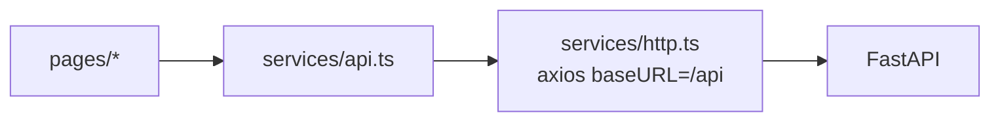

开发模式 Vite 将 `/api` 代理至 `http://127.0.0.1:8021`；生产构建后由同源 FastAPI 或 nginx 转发。

### 9.3 报告可视化

`Report` 页使用 ECharts 雷达图展示各维度均值；表格列出 `eval_result` 逐条指标；Modal 展示 `judge_detail` JSON 供人工复核 LLM 评判理由。

---

## 10. 部署、运维与安全

### 10.1 Docker Compose

`docker-compose.yml` 定义 `server` 与 `frontend` 服务；`Dockerfile.server` 安装 Python 依赖并启动 uvicorn；`Dockerfile.frontend` 多阶段构建静态资源。

### 10.2 数据备份

- **核心资产**：`server/data/rag_eval.db`（循环测试后可达数 GB）；
- **导出副本**：`docs/exports/` 下 MD/JSON；
- **规划文件**：`docs/task_groups_plan.json`。

建议定期备份 DB 与 exports，避免仅依赖单机 SQLite。

### 10.3 性能调优

| 旋钮 | 位置 | 说明 |
|------|------|------|
| `concurrency` | `RunConfig` / 任务表单 | 增大可加速，受 dagent/Judge 限流约束 |
| `top_k` | 检索配置 | 影响检索耗时与 Context 指标 |
| SQLite WAL | `db.py` | 已启用，避免长事务锁库 |
| 循环 `global_dedup` | loop 创建参数 | 真时跨任务查重 SQL 较重 |

### 10.4 安全注意

- `judge_config.api_key` 存于 SQLite **明文**，需限制 DB 文件权限；
- CORS 当前为 `allow_origins=["*"]`，公网部署应收紧；
- 导出脚本与 API 可能含完整问答与切片内容，注意数据分级。

### 10.5 运维脚本

| 脚本 | 用途 |
|------|------|
| `server/scripts/export_loop_all_groups.py` | 从 DB 导出 14 组全量问答 |
| `server/scripts/batch_create_tasks.py` | 批量创建循环任务 |
| `server/scripts/export_loop_batches_recall_md.py` | 导出召回 MD |

---

## 11. 扩展开发指南

### 11.1 新增 RAG 平台 Adapter

1. 在 `sdk/rag_eval/adapters/` 新建 `my_platform.py`；
2. 实现 `retrieve` / `chat`，映射为 `RetrievedChunk` / `AgentResponse`；
3. 在 `platform_config.type` 增加枚举，Server 侧 `task_service` 按 type 实例化。

### 11.2 新增评测指标

1. 在 `LLMJudge` 增加 `score_xxx` 方法；
2. `EvalRunner._eval_sample` 中调用；
3. `SampleResult` / `eval_result` 表增加列 + 迁移；
4. 前端 Report 增加展示卡片。

### 11.3 新增 API 模块

1. `server/api/` 新建路由文件；
2. `main.py` `include_router`；
3. `frontend/services/api.ts` 增加客户端方法。

### 11.4 测试建议

- **单元测试**：`evaluators/retrieval.py` 规则指标边界；`parser.py` MD 样例；
- **集成测试**：Mock dagent HTTP，跑通 `EvalRunner` 单样本；
- **回归**：固定小数据集 + Judge 模型版本记录在报告中。

---

## 12. 数据库字段字典（详表）

本章列出主要表的字段语义，便于写 SQL 报表、对接 BI 或二次开发。JSON 列在 SQLite 中以 `TEXT` 存储，应用层 `json.loads` 解析。

### 12.1 platform_config

| 字段 | 类型 | 说明 |
|------|------|------|
| id | TEXT PK | UUID hex |
| name | TEXT | 展示名称，如「dagent 生产」 |
| type | TEXT | 默认 `dagent`，预留其他 Adapter |
| base_url | TEXT | 如 `https://dagent.d-robotics.cc` |
| org_id | TEXT | 组织 ID，检索与对话必传 |
| token | TEXT | 可选 Bearer Token |
| created_at | TEXT | ISO 时间戳 |

### 12.2 judge_config

| 字段 | 类型 | 说明 |
|------|------|------|
| embed_base_url | TEXT | 为空则回退 base_url |
| embed_api_key | TEXT | 为空则回退 api_key |
| embed_model | TEXT | 去重与 Answer Relevance 使用 |

### 12.3 eval_sample

| 字段 | 类型 | 说明 |
|------|------|------|
| relevant_chunk_ids | TEXT | JSON 数组，Hit/MRR/NDCG 必需 |
| knowledge_hub_id | TEXT | 样本级 hub，可与任务级叠加 |
| source_file_id | TEXT | 可选，追溯出题文件 |
| metadata | TEXT | 扩展 JSON |

### 12.4 eval_task

| 字段 | 类型 | 说明 |
|------|------|------|
| eval_retrieval | INTEGER | 1/0，与 selected_metrics 二选一逻辑在 RunConfig |
| eval_generation | INTEGER | 1/0 |
| selected_metrics | TEXT | JSON 数组，非空时覆盖上述开关 |
| file_id_list | TEXT | 检索时限制文件范围 |
| concurrency | INTEGER | 默认 3 |
| progress / total | INTEGER | 已完成样本数 / 总样本数 |

### 12.5 eval_result

逐样本存储完整评判：`retrieved_chunks` 为正文数组 JSON；`judge_detail` 为各 LLM 指标原始返回，供 UI 下钻。

### 12.6 single_jump_result

| 字段 | 说明 |
|------|------|
| retrieved | 原始 dagent 返回 JSON 数组，保留 `cosine_distance_1` |
| is_file_hit | 预期 file_id 是否出现在召回列表 |
| is_chunk_hit | expected_chunk_id 是否在 hit_top_k 内 |
| chunk_hit_rank | 命中时排名，从 1 起 |
| raw_chunk_headers | 用于与 qa_gen 的 chunk_headers 对齐展示 |

### 12.7 qa_gen_question

| 字段 | 说明 |
|------|------|
| status | pending / approved / rejected |
| dup_of | 若重复，指向主题库中已有题 id |
| dup_similarity | 向量相似度 |
| embedding | 存 JSON 向量，去重用 |
| chunk_content_preview | 前 500 字，审核时免查库 |

### 12.8 loop_task

累计字段 `total_generated`、`total_approved`、`total_recalled`、`total_file_hit` 等由引擎每轮刷新；`expected_chunk_count` 与分批规划对齐，用于校验从 dagent 拉取的切片数量是否完整。`global_dedup=1` 时去重范围扩大到全部已批准题目。

### 12.9 loop_round

每轮关联 `qa_gen_task_id` 与 `single_jump_task_id`，`status` 跟踪本轮是进行中还是已完成，便于服务重启后从断点阶段继续。

---

## 13. REST API 端点详解

以下按模块列出常用端点；HTTP 方法后的路径均相对于 `/api`。

### 13.1 配置 `/config`

| 方法 | 路径 | 说明 |
|------|------|------|
| GET | `/config/platform` | 列表 |
| POST | `/config/platform` | 创建，body: name, base_url, org_id, token? |
| DELETE | `/config/platform/{id}` | 删除 |
| GET | `/config/judge` | Judge 列表 |
| POST | `/config/judge` | 创建 Judge + Embedding 配置 |

### 13.2 数据集 `/dataset`

| 方法 | 路径 | 说明 |
|------|------|------|
| GET | `/dataset/list` | 所有数据集 |
| GET | `/dataset/{id}` | 含样本列表 |
| POST | `/dataset/create` | name, description |
| POST | `/dataset/sample/add` | 单条样本 |
| POST | `/dataset/import` | multipart JSON 文件 |
| POST | `/dataset/generate` | 触发 LLM 生成，返回 generate_task_id |
| GET | `/dataset/generate/{id}` | 生成进度 |
| GET | `/dataset/chunks-preview` | 预览 hub 下切片规模 |

### 13.3 评测任务 `/task` 与报告 `/report`

| 方法 | 路径 | 说明 |
|------|------|------|
| POST | `/task/run` | 创建并异步执行 eval_task |
| GET | `/task/list` | 任务列表含 status、progress |
| GET | `/report/{task_id}` | 聚合指标 + interpretation |
| GET | `/report/{task_id}/items` | 分页样本明细 |

### 13.4 单跳 `/single-jump`

| 方法 | 路径 | 说明 |
|------|------|------|
| POST | `/single-jump/task` | Form: env_url, org_id, md_file, top_k, agent_id… |
| POST | `/single-jump/task/batch` | 批量文件 |
| GET | `/single-jump/task/{id}/summary` | 汇总指标 |
| GET | `/single-jump/task/{id}/sections` | 章节树 |
| GET | `/single-jump/task/{id}/results` | ?section= 过滤 |
| GET | `/single-jump/task/{id}/export-failed-md` | 导出失败题为 MD |

### 13.5 循环 `/loop`

| 方法 | 路径 | 说明 |
|------|------|------|
| POST | `/loop/task` | Form 创建循环任务 |
| POST | `/loop/task/{id}/pause` | 暂停 |
| POST | `/loop/task/{id}/resume` | 恢复 |
| POST | `/loop/task/{id}/stop` | 停止 |
| GET | `/loop/task/{id}/export` | ?format=md\|json&category=all\|hit\|… |

### 13.6 问题生成 `/qa-gen`

`qa_gen.py` 与 `qa_gen_dagent.py` **共享前缀** `/api/qa-gen`：前者上传 MD/文件列表出题，后者从 dagent 拉取目录树与切片。注意路由注册顺序避免路径冲突。

| 能力 | 端点示例 |
|------|----------|
| dagent 文件树 | GET `/qa-gen/dagent/tree?org_id=` |
| 创建出题任务 | POST `/qa-gen/task/from-dagent` |
| 审核 | POST `/qa-gen/question/{id}/approve` |

---

## 14. 循环引擎深度解析

### 14.1 启动与断点续跑

`run_loop_task` 被 `asyncio.create_task` 调用后立即返回。引擎启动时查询 `loop_round` 最后一条记录：

- 若上一轮 `single_jump` 未完成，则继续等待或重试；
- 若已完成且未达终止条件，则 `current_round += 1` 并新建 `loop_round` 行。

服务崩溃后，`recover_orphaned_loops` 将 `status=running` 改为 `paused`，人工确认后调 resume。

### 14.2 单轮各阶段耗时分布

```mermaid
gantt
    title 典型单轮耗时构成（示意）
    dateFormat X
    axisFormat %s
    section 出题
    拉切片与LLM生成     :a1, 0, 40
    section 去重
    Embedding批量比对   :a2, after a1, 15
    section 召回
    单跳并发检索        :a3, after a2, 30
```

实际占比取决于 `concurrency`、切片数、Judge 模型速度及 dagent 集群负载。组 1 批次 1 在远程环境上常见数千条 approved 题，单轮可能持续数十分钟。

### 14.3 终止条件

| 条件 | 行为 |
|------|------|
| `max_rounds > 0` 且达到 | 正常结束 |
| `max_questions > 0` 且累计 approved 达到 | 正常结束 |
| 连续若干轮无新 approved | 可配置空轮退出（引擎内 consecutive_empty_rounds） |
| 用户 stop | 立即写 stopped |
| 异常 | status=failed，error_message 记录栈信息 |

### 14.4 与单跳模块的协作

循环引擎不直接调用 `SingleJumpTester` 类，而是通过内部函数或 API 层复用「生成 MD → 创建 task → 轮询完成」流程，保证与手动单跳使用同一套解析与命中逻辑，避免统计口径不一致。

---

## 15. 单跳 MD 格式与 FileMapper

### 15.1 MD 结构约定

```markdown
# 第1章 章节展示标题

## path/to/file.md / doc_name
> 原始切片标题: 完整 headers 路径
# 1. doc_name_Document
> 由 LLM 自动生成的问答对

## Q1: 问题正文？

**A1:** 参考答案正文

> chunk_id: abc123...
```

- `# 第N章`：人类可读章节名；
- `##` 行：与 `FileMapper` 键一致，通常为 `file_name / doc_name`；
- `Q`/`A` 编号：解析器正则提取；
- 可选 `chunk_id` 行：用于切片级命中。

`loop_recall_md.py` 与 `single_jump/parser.py` 共用同一套生成规则，保证「循环内导出 → 再导入单跳」不丢字段。

### 15.2 FileMapper 匹配策略

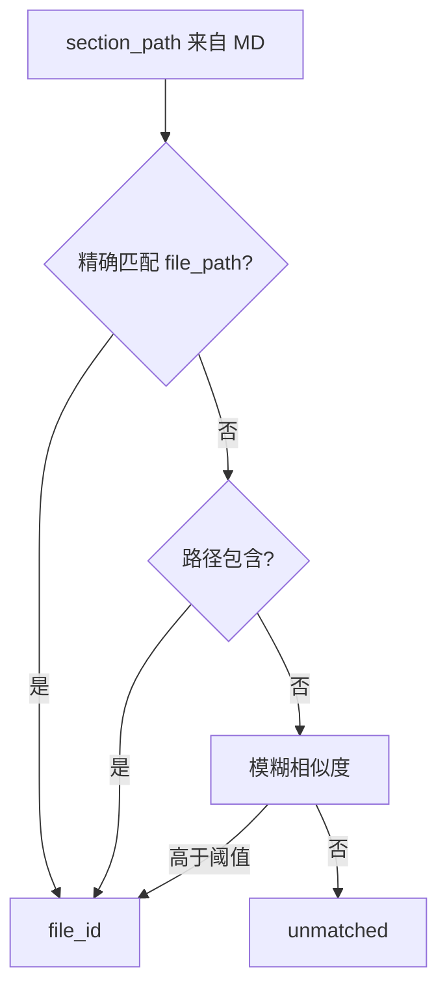

未匹配章节仍参与召回测试，但 `is_file_hit` 统计为未命中文件；报告中的「章节匹配率」帮助发现路径规范问题。

---

## 16. LLM Judge 调用链与成本

### 16.1 单样本 Judge 调用次数估算

设回答被拆为 $N$ 条声明，检索上下文分为 $K$ 个 chunk：

| 指标 | 约 LLM 次数 |
|------|-------------|
| Faithfulness | $1 + N$ |
| Groundedness | 1 |
| Context Precision | 1 |
| Context Recall | 1 |
| Answer Correctness | 1 |
| Answer Relevance | 1 + 3 次 embedding |

综合评测全开时，单样本可达 **10+ 次** LLM 调用。批量任务应合理设置 `concurrency` 与 `selected_metrics`，避免 Judge API 限流。

### 16.2 Prompt 语言与 JSON 解析

所有 Prompt 为中文指令，要求模型**仅输出 JSON**。`OpenAICompatibleJudge` 对返回做 `json.loads`，失败时捕获异常并将 raw 文本写入 `judge_detail` 便于排查。生产环境建议选用 JSON 遵循能力较强的模型（如 GPT-4o、DeepSeek-V3）。

### 16.3 Embedding 用途

- **Answer Relevance**：回答 → 生成 3 个假设问题 → 与原始问题做 cosine；
- **循环去重**：approved 题的 question 字段向量与新区块比对；
- 二者共用 `judge_config` 中的 embed 三元组，可与 chat 模型异构部署。

---

## 17. 前端页面交互说明

### 17.1 测试集页

支持三种来源并列：表格手动新增、上传 JSON、侧栏触发「LLM 生成」并轮询 `generate_task`。详情页展示样本字段，可编辑 `relevant_chunk_ids`（JSON 文本框）。

### 17.2 评测任务页

表单字段与 `eval_task` 表一一对应；提交后列表展示进度条 `progress/total`；完成后跳转 Report。删除任务不级联删除 report 时需确认实现（当前以实现为准）。

### 17.3 单跳报告页

左侧章节树，右侧问题列表；支持按 section 筛选、查看每条 retrieved JSON、导出未命中 MD。颜色区分 file_hit / chunk_hit / 空召回。

### 17.4 问题生成页

Tab 区分「文件上传」与「dagent 数据源」；dagent 模式先加载文件树勾选 file_ids；问题表支持 approve/reject、编辑 Q/A；embedding 去重结果展示 dup_similarity。

---

## 18. 故障排查手册

| 现象 | 可能原因 | 处理 |
|------|----------|------|
| 任务长期 running | 后台协程异常退出未写库 | 查 server 日志；手动改 status |
| Judge 全 0 分 | API Key 无效或 JSON 解析失败 | 查 judge_detail 原始返回 |
| Hit Rate 全空 | 未填 relevant_chunk_ids | 补标注或关闭规则指标 |
| 单跳章节全 unmatched | file 路径与知识库不一致 | 检查 MD `##` 行与 dagent 路径 |
| 循环任务暂停无法恢复 | 进程重启后 _loop_controls 丢失 | 仅支持同进程 resume；否则新起任务 |
| SQLite database locked | 并发写冲突 | 已设 busy_timeout；避免多进程写同一库 |
| 导出 OOM | 一次加载百万级 JSON | 使用 export_loop_all_groups 按批次导出 |
| dagent 429 | 并发过高 | 降低 concurrency |

### 18.1 日志位置

开发时 uvicorn 标准输出；历史曾写入根目录 `server*.log`（已清理）。生产建议配置结构化日志到文件或 ELK。

---

## 19. dagent 远程集成实践

### 19.1 环境划分

| 环境 | 用途 |
|------|------|
| dagent-dev | 功能联调 |
| dagent.d-robotics.cc | 14 组循环生产数据所在 |

`platform_config` 与 `loop_task.env_url` 应指向被测环境，避免 dev 数据写入生产库统计。

### 19.2 跨切片模式（cross_chunk）

当前部分 dagent 版本不支持检索 API 的 `file_id_list` 过滤，单跳与循环建议 **cross_chunk=true**，在更大池中检索后再用 `is_file_hit` 判断文件是否正确。这与「限定文件内检索」的理想实验设置不同，报告解读时需注明。

### 19.3 大规模跑数建议

1. 按 [task_groups_plan.json](./task_groups_plan.json) 分批，每批 100 切片；
2. 组间并行度受 Judge 与 dagent 配额限制，建议组内顺序、组间适度并行；
3. 每批完成后执行 `export_loop_all_groups.py` 或 API export 做冷备；
4. `rag_eval.db` 体积膨胀后 VACUUM 需停机维护。

### 19.4 问答集资产用途

`docs/exports/` 下 23 万+ 题可用于：检索离线评测、训练数据构造、Bad Case 分析、版本回归对比。JSON 行内含 `chunk_id` 可回连 dagent 切片。

---

## 20. SDK CLI 与配置参考

### 20.1 命令行

```bash
rag-eval generate --config config.yaml --output dataset.json
rag-eval run --config config.yaml --dataset dataset.json --output report.json
```

`config.yaml` 结构见 `docs/config.example.yaml`：含 `platform`、`judge`、`agent_id`、`knowledge_hub_id`、`top_k`、`concurrency` 等。

### 20.2 编程式调用

Server 与 CLI 均依赖同一 `EvalRunner`，保证指标口径一致。自定义 `progress_cb` 可在 CI 中打印进度条。

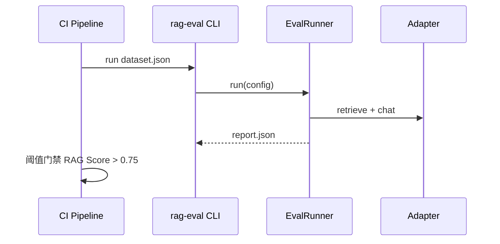

---

## 21. 多跳召回与多跳出题（技术说明）

### 21.1 多跳问题模型

多跳样本除 `question`、`answer` 外，核心结构为 `hops[]`：每一跳描述一个子问题、期望检索的 `section_path` / `file_id`，以及该跳对最终答案的贡献权重。评测时引擎按跳次顺序调用检索 API，记录每跳 top-K 结果，再合并为 `retrieved` 全集用于兼容旧版统计。

**全链路命中（full_hit）**：所有期望跳的文件或切片均命中；**部分命中（partial_hit）**：至少一跳命中。与单跳相比，多跳更考察知识库跨文档关联能力。

### 21.2 多跳与 Agent 回答

若配置 `agent_id` 与 `judge_config_id`，在分跳检索完成后可调用 Agent 生成最终答案，并由 Judge 评判与标准答案的一致性。该路径同时消耗检索与对话配额，适合端到端 RAG 演示而非纯检索压测。

### 21.3 multi_hop_gen

`multi_hop_gen_task` 支持 `source=file`（上传结构化工单）或 `source=dagent`（按 org 拉目录）。`hops_per_question` 控制每题跳数，`questions_per_group` 控制每组生成数量。生成结果存入 `multi_hop_gen_question`，经人工审核后可导出为多跳 MD 再回流多跳召回测试。

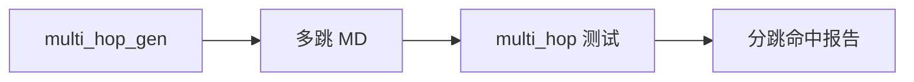

---

## 22. DatasetGenerator 与测试集自动生成

### 22.1 流程

`DatasetGenerator` 接收 `file_id_list`，通过 Adapter 拉取每个文件的切片列表。对每个切片：

1. 将切片正文（及可选图片多模态描述）填入出题 Prompt；
2. 调用 Judge LLM 生成「问题 + 参考答案」；
3. 二次调用质量评估 Prompt，低于 `quality_threshold` 的丢弃；
4. 写入 `eval_sample` 或仅返回内存对象。

### 22.2 与综合评测的衔接

Web UI 的「LLM 自动生成」创建 `generate_task` 异步任务，完成后样本落入指定 `eval_dataset`。用户可人工删改再启动 `eval_task`，形成「半自动」评测流水线。

### 22.3 标注成本对比

| 方式 | 人工成本 | 适合场景 |
|------|----------|----------|
| 全手动 | 高 | 黄金集、合规场景 |
| LLM 生成 + 人工抽检 | 中 | 快速扩容 |
| 循环测试自动生成 | 低 | 覆盖度优先、允许噪声 |

---

## 23. 报告对象模型（EvalReport）

`EvalReport` 由 `EvalRunner._build_report` 构造，包含：

- 任务级聚合：各 `avg_*` 字段、`rag_score`、`hallucination_rate`；
- 样本级列表：`List[SampleResult]`，每条含指标分数字段与 `judge_detail` 字典；
- 序列化：`report.save(path)` 输出 JSON，CLI 与 Server 共用。

Server 额外调用 Judge 生成自然语言 `interpretation`，写入 `eval_report` 表，前端直接展示而无需客户端再调 LLM。

**SampleResult 字段与 UI 映射：**

| 字段 | 报告页展示 |
|------|------------|
| hit_rate, mrr, ndcg | 检索卡片 / 雷达图轴 |
| faithfulness 等 | 生成卡片 |
| judge_detail | Modal JSON |
| error | 红色错误行 |

---

## 24. 并发模型与资源约束

### 24.1 asyncio 语义

Server 主线程运行在 uvicorn 事件循环上。`run_eval_task`、`run_loop_task`、单跳后台任务均为 `asyncio.create_task` 调度的协程，共享同一线程。CPU 密集操作（如大 JSON 解析）应避免阻塞过久，必要时用 `asyncio.to_thread`。

### 24.2 Semaphore

`EvalRunner` 与 `SingleJumpTester` 均使用 `asyncio.Semaphore(concurrency)` 限制同时在飞的 HTTP 请求数。过大并发会导致：

- dagent 返回 429 或超时；
- Judge API 账单激增；
- SQLite 写锁等待。

推荐生产从 3–5 起步，循环大规模任务可提到 10–20 并监控错误率。

### 24.3 连接池

`DagentAdapter` 每次调用新建 `aiohttp.ClientSession`，简单但高并发下开销大。若需优化可改为 Session 复用（注意线程/协程安全）。

---

## 25. 类图：SDK 核心类型

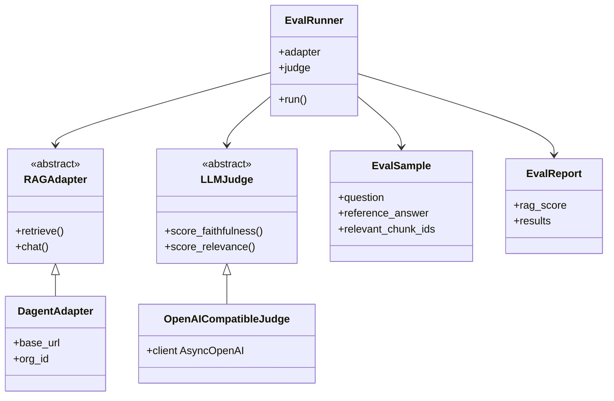

---

## 26. 安全、合规与权限（建议）

当前版本为**内网工具**假设：无用户登录、无 RBAC。若对外暴露：

1. 增加 OAuth2 / 公司 SSO，API 带 Bearer；
2. `judge_config.api_key` 改为 KMS 引用或环境变量注入，库内不存明文；
3. 导出接口加审计日志；
4. 按 org 隔离 `platform_config`，防止误测他人知识库。

---

## 27. 版本演进与已知限制

| 限制 | 说明 | 规避 |
|------|------|------|
| 单进程循环控制 | pause/resume 不能跨 uvicorn worker | 单 worker 或 Redis 协调 |
| qa_gen 路由共用前缀 | 两模块同 prefix | 注册顺序、集成测试 |
| README 端口 8003 vs 代码 8021 | 历史文档差异 | 以实际启动参数为准 |
| 超大 SQLite | 循环后 DB 数 GB | 归档 exports、分库 |
| file_id 过滤 | 部分 dagent 不支持 | cross_chunk |

---

## 28. 典型使用场景 walkthrough

### 28.1 场景 A：发版前回归

1. 维护固定 `eval_dataset`（200 条黄金集）；
2. CI 中 `rag-eval run`，`selected_metrics` 仅开 faithfulness + hit_rate；
3. 对比上一版本 `report.json`，RAG Score 下降超过 5% 则失败。

### 28.2 场景 B：新知识库冷启动

1. `qa_gen` 从 dagent 选目录出题；
2. 人工审核 10% 样本；
3. 单跳全库 MD 导出召回报告；
4. 针对 file_miss 章节调整切片策略。

### 28.3 场景 C：远程 4140 切片覆盖

1. 按 `task_groups_plan` 建 42 个 `loop_task`；
2. 每组跑满 `max_rounds=5` 或直至收益递减；
3. `export_loop_all_groups.py` 汇总；
4. 用 exports JSON 训练或分析高频未命中 chunk。

### 28.4 场景 D：多跳文档联调

1. `multi_hop_gen` 生成推理链问题；
2. 导出 MD → `multi_hop` 任务；
3. 查看 `hop_hit_count` 与 `full_hit` 比例，定位薄弱跳次。

---

## 29. 与早期设计文档的关系

[rag-eval-framework-design.md](./rag-eval-framework-design.md) 撰写于框架立项阶段，侧重指标定义与分层理念。本文档（技术规格说明书）对齐**当前代码实现**，补充了循环测试、多跳、qa_gen、SQLite 表结构及运维细节。若两处冲突，以本规格书与源码为准。

---

## 30. 名词索引（中英对照）

| 中文 | 英文 | 代码中的关键符号 |
|------|------|------------------|
| 评测运行器 | Eval Runner | `EvalRunner` |
| 平台适配器 | RAG Adapter | `RAGAdapter` |
| 评判器 | LLM Judge | `LLMJudge` |
| 单跳 | Single-hop | `single_jump` |
| 多跳 | Multi-hop | `multi_hop` |
| 循环任务 | Loop Task | `loop_task` |
| 调和均值 | Harmonic Mean | `rag_score` 计算 |
| 幻觉率 | Hallucination Rate | faithfulness < threshold |
| 切片 | Chunk | `RetrievedChunk` |
| 知识库 | Knowledge Hub | `knowledge_hub_id` |

---

## 31. 检索规则指标实现细节

本节说明 `sdk/rag_eval/evaluators/retrieval.py` 中各函数的行为边界，便于复现论文指标或对接外部评测框架。

### 31.1 Hit Rate@K

对单个问题，若在召回列表前 K 个位置中**至少出现一个** `chunk_id` 属于标注集合 `relevant_chunk_ids`，则该样本 hit=1，否则为 0。数据集层面 Hit Rate 为所有样本 hit 的算术平均。该指标对「只要召回到一个相关文档即可」的场景敏感，无法区分相关结果排名优劣。

### 31.2 MRR@K

取第一个相关 chunk 的排名 rank（从 1 开始），贡献 $1/\text{rank}$；若无相关则贡献 0。数据集 MRR 为样本 MRR 的平均。相比 Hit Rate，MRR 对「相关结果是否靠前」更敏感，适合排序质量评估。

### 31.3 NDCG@K

实现采用二元相关度：相关 chunk 为 1，否则为 0。计算 DCG@K 时使用 $\sum_i \frac{2^{rel_i}-1}{\log_2(i+1)}$，再以理想 DCG 归一化。若标注集中有多个相关 chunk，全部命中可获得更高 NDCG。K 默认与 `RunConfig.top_k` 一致。

### 31.4 与 LLM 检索指标的关系

Hit/MRR/NDCG 依赖**离散的 chunk_id 标注**；Context Precision/Recall 依赖**自然语言参考答案**，可捕捉语义等价但 chunk_id 未标注的情况。生产评测建议两套指标并行：规则指标看排序，LLM 指标看语义覆盖。

---

## 32. Windows 与跨平台注意事项

`server/main.py` 在 `win32` 平台将 stdout/stderr 重定向为 UTF-8，避免控制台 GBK 打印特殊 Unicode（如数学符号）时崩溃。`single_jump/tester.py` 与 `loop_engine.py` 同样调用 `reconfigure(encoding='utf-8')`。

路径上 Server 使用 `Path(__file__)` 定位 `sdk` 与 `frontend/dist`，避免硬编码盘符。运维脚本应避免写死 `d:/project/...`，改用相对路径。

SQLite 在 Windows 上注意：

- 勿将 `rag_eval.db` 放在同步盘（OneDrive）上，易导致锁异常；
- 杀毒软件实时扫描大库文件会拖慢写入，建议排除 `server/data/`。

---

## 33. Docker 与 nginx 配置说明

`docker-compose.yml` 通常定义两个 service：`server` 暴露 API 端口，`frontend` 构建静态资源或由 nginx 托管。`nginx.conf` 将 `/api` 反向代理至 uvicorn，其余路径走静态文件，并配置 `try_files` 支持 React Router 前端路由。

`Dockerfile.server` 安装 `requirements.txt`，复制 `server/` 与 `sdk/`，工作目录设为 `server`，CMD 为 uvicorn。构建上下文应为 `rag-eval` 根目录而非 `server/`，否则找不到 sdk。

镜像内数据库路径需挂载 volume，例如 `- ./server/data:/app/server/data`，防止容器销毁丢数。

---

## 34. 提示词模板（prompt_template）机制

`prompt_template` 表允许用户保存可复用的出题或评判 Prompt 正文。创建 `qa_gen_task` 时可指定模板 id，生成逻辑将基础 Prompt 与模板合并，实现「同一套切片、不同题型」的 A/B。模板 CRUD 通过 `/api/prompt-template` 完成，前端可在问题生成页下拉选择。

设计意图是**将 Prompt 版本从代码中解耦**，使领域专家可在 UI 调整措辞而无需发版 Server。若模板为空则回退代码内默认 Prompt（见 `dataset/generator.py` 与 qa_gen 路由内联字符串）。

---

## 35. 数据导出格式说明

### 35.1 循环导出 JSON 结构

`export_loop_all_groups.py` 产出顶层字段：

- `exported_at`、`environment`、`org_id`；
- `task_groups[]`：每组含 `batches[]`；
- 每 batch 含 `questions[]`，单题含 `question`、`reference_answer`、`chunk_id`、`file_name`、`round`、`quality_score` 等。

该格式适合用 jq/Python 做二次聚合，例如按 `file_name` 统计每文件出题数。

### 35.2 循环导出 MD 结构

与单跳解析器兼容，可直接作为下一轮 `single-jump` 上传文件，形成「生成 → 验证 → 修正 → 再验证」闭环。

### 35.3 综合评测 report.json

CLI `rag-eval run --output report.json` 输出 `EvalReport` 全量序列化，含 `results` 数组。可用于离线绘图或与历史版本 diff。

---

## 36. 质量保障建议（组织级）

1. **黄金集**：维护 100–500 条人工审核样本，任何检索模型变更必跑；
2. **Judge 模型版本冻结**：报告中记录 `judge_config.model`，避免不可比；
3. **定期冷备**：`rag_eval.db` + `docs/exports/` 双轨；
4. **指标看板**：从 `eval_report` 表 ETL 到 Grafana，按日趋势监控 RAG Score；
5. **Bad Case 例会**：单跳 `export-failed-md` 导出未命中集，分配给切片优化负责人。

---

## 37. 读者常见问题（FAQ）

**问：评测任务为何一直 pending？**  
答：若未触发 `create_task` 或进程未启动后台协程，会停留 pending。检查 uvicorn 是否运行、API 是否返回 task_id。

**问：能否只评检索不评生成？**  
答：可以。`eval_retrieval=1`、`eval_generation=0`，或 `selected_metrics` 仅列检索项。

**问：循环任务与 qa_gen 区别？**  
答：qa_gen 单轮出题+审核；循环在多轮中自动串联出题、去重、单跳验证并累计统计。

**问：23 万题导出是否含重复？**  
答：去重后 approved 题；不同轮次可能对同一切片有不同问法，是否语义重复需用 embedding 再滤。

**问：如何对接非 dagent 平台？**  
答：实现 `RAGAdapter`，在 Server 实例化处按 `platform_config.type` 分支。

**问：RAG Score 很低但 Faithfulness 很高？**  
答：调和均值受 Context Precision/Recall 拖累，说明检索上下文质量差而非生成幻觉。

---

## 38. 文档贡献与维护

修改核心流程（如新增指标、表结构变更）时，请同步更新：

1. 本技术规格说明书对应章节；
2. 根目录 `README.md` 功能表；
3. `docs/README.md` 索引；
4. OpenAPI 注解（如有）。

Pull Request 模板可要求勾选「已更新技术文档」。

---

## 39. Server 启动生命周期

```mermaid
sequenceDiagram
    participant U as uvicorn
    participant M as main.py
    participant DB as init_db
    participant R as recover_orphaned_loops

    U->>M: import app
    M->>M: sys.path sdk
    M->>M: include_router × 11
  Note over M: lifespan start
    M->>DB: executeschema + migrations
    M->>R: running loop → paused
    M-->>U: yield app ready
    Note over M: 处理 HTTP 请求
    Note over M: lifespan end
```

应用启动时 `init_db` 执行 `schema.sql` 中 `CREATE TABLE IF NOT EXISTS`，随后 `_run_migrations` 对老库补列。任何 `running` 状态的 `loop_task` 在崩溃后被标记 `paused`，防止 UI 显示「运行中」却无法控制。

静态资源：若存在 `frontend/dist`，`app.mount("/", StaticFiles)` 将 SPA 挂在根路径，API 仍在 `/api` 下，需注意路由匹配顺序（API 路由先注册）。

---

## 40. 单跳 tester 请求载荷说明

`SingleJumpTester` 向 dagent 发起的语义检索 POST 体核心字段：

- `query`：问题正文；
- `org_id`：组织；
- `top_k`：召回数量（展示用，命中判断可能用更小的 `hit_top_k`）；
- `knowledge_hub_id`：若任务指定；
- 可选 `file_id_list`：非 cross_chunk 时限制范围。

响应解析保留每条结果的 `file_id`、`knowledge_md_header_split_id`、`cosine_distance_1`、`headers` 等原始字段写入 `retrieved` JSON，以便报告页展示完整证据链。

错误处理：单条 QA 失败写入 `error` 字段，不中断整任务；summary 统计时排除或单独计数 error 行。

---

## 41. 去重算法（dedup）参数

`service/dedup.py` 对候选题计算 embedding，与库中已批准题做余弦相似度。超过阈值则标记 `dup_of` 指向最相似题 id，并可选自动 reject。

| 参数 | 典型值 | 影响 |
|------|--------|------|
| 相似度阈值 | 0.85–0.92 | 越高越宽松 |
| global_dedup | true/false | 跨 loop_task 比对 |
| 比对字段 | question | 仅问题文本，不含答案 |

全局去重在 14 组大规模跑数时显著增加 SQL 与 embedding 调用，但能有效降低「同一文档重复问法」占比。

---

## 42. 前端 http 客户端与错误处理

`services/http.ts` 基于 axios，`baseURL` 设为 `/api`。响应拦截器统一处理 4xx/5xx，Ant Design `message.error` 提示。文件上传使用 `FormData`，不手动设 Content-Type 以保留 boundary。

长轮询：任务列表页 `setInterval` 刷新 progress，间隔约 2–5 秒；任务完成后清除定时器。大结果集分页：`qa_gen` questions 接口支持 `page`/`page_size`。

---

## 43. 评测指标体系与 RAGAS 对照

本平台指标设计参考 RAGAS、TruLens 等框架的常见定义，但实现为独立中文 Prompt，**数值不可与 RAGAS 官方实现直接划等号**。对照关系如下：

| 本平台 | 相近概念 | 差异 |
|--------|----------|------|
| Faithfulness | faithfulness | 两步 claim 验证 |
| Answer Relevance | answer_relevancy | 反推问题 + embedding |
| Context Precision | context_precision | LLM 判 useful |
| Context Recall | context_recall | 陈述级支持 |
| Groundedness | 部分 attribution | 显式 chunk index |

对外汇报时建议注明「内部评测框架」及 Judge 模型版本。

---

## 44. 性能基准（经验值，非承诺）

在「Judge=gpt-4o、dagent 内网、concurrency=3、样本 100 条、全开指标」条件下，单次 eval_task 约 15–40 分钟，主要耗时在 Faithfulness 与 Context 类 LLM 调用。单跳 1000 题、top_k=10、concurrency=10，约 10–25 分钟，主要受 dagent 检索延迟制约。

循环任务单批 100 切片、5 轮、每切片 5 题量级，总 LLM 调用可达数万次，应安排在非高峰时段并监控配额。

---

## 45. 代码阅读路径（新人 onboarding）

1. `sdk/rag_eval/runner.py` — 理解主流程；
2. `sdk/rag_eval/adapters/dagent.py` — 理解外部依赖；
3. `server/service/task_service.py` — 理解持久化；
4. `server/api/task.py` + `frontend/pages/Task` — 理解端到端；
5. `server/service/loop_engine.py` — 理解最复杂编排；
6. `server/models/schema.sql` — 理解数据全貌。

每模块配有本规格书第 4、6 章交叉引用。

---

## 46. eval_task 创建请求体字段说明

Web UI 提交 `POST /api/task/run` 时，JSON 或表单字段与数据库列映射如下。理解该映射有助于用脚本批量建任务。

| 请求字段 | 必填 | 说明 |
|----------|------|------|
| dataset_id | 是 | 已存在的数据集 |
| platform_config_id | 是 | dagent 连接 |
| judge_config_id | 是 | LLM 评判 |
| agent_id | 是 | 生成层对话用 |
| knowledge_hub_id | 是 | 检索范围 |
| name | 否 | 任务展示名 |
| top_k | 否 | 默认 10 |
| eval_retrieval / eval_generation | 否 | 布尔 |
| selected_metrics | 否 | JSON 数组，覆盖上述布尔 |
| file_id_list | 否 | 限制检索文件 |
| concurrency | 否 | 默认 3 |

创建成功后 Server 立即 `asyncio.create_task(run_eval_task(task_id))`，HTTP 响应不等待评测结束。

---

## 47. 切片质量与评测结果的因果关系链

评测低分往往并非单一环节失败，建议按下列因果链排查：

```mermaid
flowchart TD
    A[切片过长/过短] --> B[检索噪声大]
    B --> C[Context Precision 低]
    A --> D[关键信息未切片]
    D --> E[Context Recall 低]
    E --> F[Agent 缺上下文]
    F --> G[Faithfulness 低或胡编]
    H[Agent Prompt 不当] --> G
    I[Embedding 模型不适配中文] --> B
```

平台提供单跳与循环工具定位 B 段；综合评测定位 C–G；需与知识库工程、Agent 配置协同优化。

---

## 48. 未来架构演进方向（规划，非承诺）

1. **任务队列外置**：Redis + Celery/RQ，支持多 Worker 与任务取消；
2. **PostgreSQL 选项**：替代 SQLite 以支撑多实例写入；
3. **Judge 缓存**：相同 (question, chunks) 哈希复用评判结果；
4. **插件化指标**：`Metric` 接口注册，UI 动态勾选；
5. **权限与租户**：org 级隔离与审计；
6. **标准数据集格式**：导入 RAGAS/HuggingFace 格式。

上述方向来自实际运维痛点，实施优先级由产品决定。

---

## 49. 缩略语表

| 缩略语 | 全称 |
|--------|------|
| RAG | Retrieval-Augmented Generation |
| LLM | Large Language Model |
| SSE | Server-Sent Events |
| WAL | Write-Ahead Logging |
| API | Application Programming Interface |
| SPA | Single Page Application |
| CRUD | Create Read Update Delete |
| ER | Entity-Relationship |
| CI/CD | Continuous Integration / Delivery |
| EVB | 项目内知识库代号 |
| org_id | dagent 组织标识 |

---

## 50. 结语

RAG Eval 平台将**可复现的指标体系**、**贴近 dagent 的工程工具链**与**大规模数据生产能力**整合在同一仓库中。本文档从架构、数据、流程、API、运维五方面描述当前实现，并配有二十余张 Mermaid 图辅助理解。随着代码迭代，请持续更新本文档与根目录 README，保持「文档 — 代码 — 数据导出」三者一致，以便团队在任何时间点都能追溯评测结论的依据。

---

## 附录 A：14 组循环测试与数据资产

大规模远程 dagent 循环测试将 4140 切片划分为 **42 批次 × 14 组**，详见 [循环测试_14组分批规则.md](./循环测试_14组分批规则.md)。全量导出（235,347 题）位于 [exports/](./exports/)。

```mermaid
flowchart TB
    subgraph Chunks["4140 切片 / 207 文件"]
        B1["批次 1-3<br/>组1"]
        B2["批次 4-6<br/>组2"]
        BDOT["…"]
        B14["批次 40-42<br/>组14"]
    end

    Chunks --> LT["loop_task × 42"]
    LT --> QR["qa_gen_question"]
    LT --> SR["single_jump_result"]
    QR --> EXP["docs/exports/ 汇总"]
    SR --> EXP
```

---

## 附录 B：文档修订记录

| 版本 | 日期 | 说明 |
|------|------|------|
| v1.0 | 2026-05-18 | 首版：架构、时序图、数据模型、指标、API、运维与字段字典 |
| v1.1 | 2026-05-18 | 扩充第 12–20 章，满足万字技术规格要求 |

---

*本文档随代码演进更新；若与实现不一致，以仓库源码为准。*
